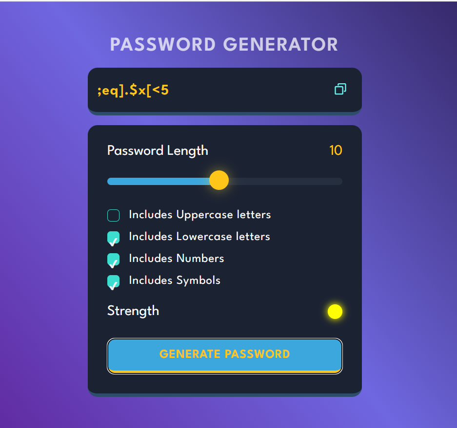

# 🔐 Password Generator by Ritesh

A sleek and interactive password generator built with **HTML**, **CSS**, and **JavaScript**. This app lets you customize your password length and characters, check its strength in real-time, and copy it instantly.

---

## 🌟 Features

- 🎚 Adjustable password length (1–20)
- 🔡 Choose character types (uppercase, lowercase, numbers, symbols)
- 🎯 Strength indicator with live color feedback
- 📋 One-click copy to clipboard with tooltip
- 🎨 Fully responsive and stylish UI

---

## 📸 Screenshot



> Make sure this file exists: `screenshots/password-generator-preview.png`

---

## 🛠 Technologies Used

- **HTML5**
- **CSS3** – with custom properties and responsive design
- **Vanilla JavaScript** – no frameworks or libraries

---

## 🚀 Getting Started

1. Clone the repo:
   ```bash
   git clone https://github.com/ritesh355/password-generator.git
   cd password-generator
